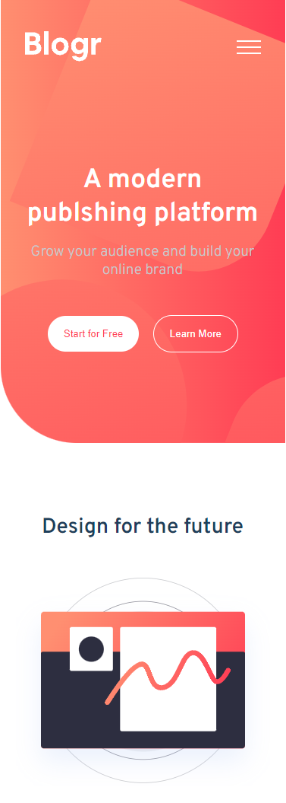

# Frontend Mentor - Blogr landing page solution

This is a solution to the [Blogr landing page challenge on Frontend Mentor](https://www.frontendmentor.io/challenges/blogr-landing-page-EX2RLAApP). 
Frontend Mentor challenges help you improve your coding skills by building realistic projects. 

## Table of contents

- [Overview](#overview)
  - [The challenge](#the-challenge)
  - [Screenshot](#screenshot)
  - [Links](#links)
- [My process](#my-process)
  - [Built with](#built-with)
  - [What I learned](#what-i-learned)
  - [Continued development](#continued-development)
  - [Useful resources](#useful-resources)
- [Author](#author)

## Overview

### The challenge

Users should be able to:

- View the optimal layout for the site depending on their device's screen size ✔️
- See hover states for all interactive elements on the page ✔️

### Screenshot

- Desktop Screenshot
<p float="left">
  
  
</p>

- Mobile Screenshot
<p float="right">
  
</p>


### Links

- Solution URL: [Blogr Solution](https://github.com/ioangheraszim/Blogr-LandingPage-FE)
- Live Site URL: [Blogr Landing Page](https://ioangheraszim.github.io/Blogr-LandingPage-FE/)

## My process

### Built with

- Semantic HTML5 markup
- CSS custom properties
- Flexbox
- Mobile-first workflow
- Javascript

### What I learned

In this project, I've gained proficiency in element positioning and delved into more advanced CSS techniques using the SASS preprocessor. Additionally, I've learned how to employ JavaScript event listeners to dynamically control the styles of a navigation bar (navbar) upon the press of a button.

The following CSS code exemplifies the precise positioning of project elements:

```css

.abnormal {
    position: relative;
    background: url(./images/bg-pattern-circles.svg) no-repeat,
      linear-gradient($vd-gray-blue, $vd-desaturated-blue);
    background-position-x: 50%;
    background-position-y: -500%;
    background-size: 150%;
    padding: 10rem 1rem 6rem 1rem;
    border-radius: 0 3rem 0 3rem;
    margin-top: 18rem;   
}

.phones {
      position: absolute;
      bottom: 50%;
      left: -2%;
      width: 21.875rem;
      height: 29.688rem;
      background: url(./images/illustration-phones.svg) no-repeat;
      background-position-x: 50%;
      background-position-y: 0;
      background-size: 100%;
}

```

The code starts by obtaining references to the 'menu-open' and 'menu-close' elements using document.getElementById.
Then two event listeners are set up, one for each button. When the 'menu-open' button is clicked, it triggers an anonymous function that performs the following actions:

Sets the style of the 'menu-close' button to display ('block').
Hides the 'menu-open' button by setting its style to none.
Obtains a reference to the navbar with the ID 'navbar-menu' and adds the 'active' class to it.
Similarly, when the 'menu-close' button is clicked, it triggers another anonymous function that does the opposite:

Hides the 'menu-close' button.
Displays the 'menu-open' button.
Removes the 'active' class from the 'navbar-menu' element.

This code essentially toggles the visibility of the 'menu-open' and 'menu-close' buttons while adding or removing the 'active' class from the 'navbar-menu' element, creating the visual effect of opening and closing a navigation bar. The 'active' class likely carries styles that control the appearance or behavior of the navbar when it is open.

```js

let menuOpen = document.getElementById('menu-open');
let menuClose = document.getElementById('menu-close');


// open navbar
menuOpen.addEventListener('click', function(){
    menuClose.style.display = 'block';  
    menuOpen.style.display = 'none';

    let navContent = document.getElementById('navbar-menu');
    navContent.classList.add("active");
})

//close navbar
menuClose.addEventListener('click', function(){
    menuClose.style.display = 'none'; 
    menuOpen.style.display = 'block';

    let navContent = document.getElementById('navbar-menu');
    navContent.classList.remove('active');
})

```

### Useful resources

- [W3Schools](https://www.w3schools.com/) - This helped me learn indepth HTML and CSS.

## Author

- Website - [Ioan Gheraszim](https://ioangheraszim.github.io/portofolio/)
- Frontend Mentor - [@ioangheraszim](https://www.frontendmentor.io/profile/ioangheraszim)
